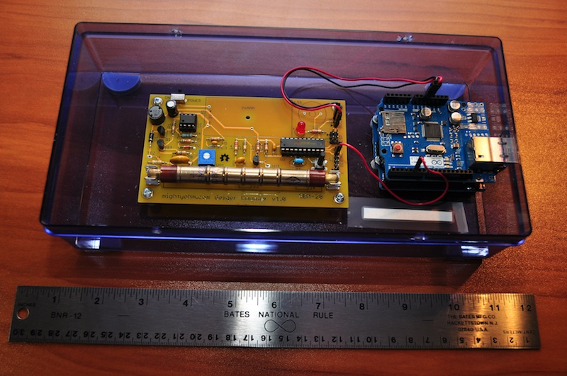

<html>
<body>
<h4>Background Radiation Monitoring Device</h4>

Building a simple background radiation monitor provides an excellent introduction to "Internet of Things" ideas and concepts. This project site contains all you need to know in order to build your own background radiation monitor - a Geiger counter "Internet Thing" - for under $150 in parts.

Building the background radiation monitor will give you an excellent introduction to a variety of technologies. You will learn about programming Arduino micro-controllers and assembling electronic components. You will learn about Linux server software, scripting for Internet applications, and displaying information with a web page.

You can find all the required software available under open source, GNU license at this project site. Please read the <a href="DIY Radmon Project Description.pdf">project description document</a> for details on procuring the materials, assembling the background radiation monitor and installing the software.

This project encompasses two software components. One component runs on the Arduino Uno with attached Ethernet shield. The other component runs on a Linux web server. Besides the Arduino Uno with attached Ethernet shield, the other required component is a modified Mighty Ohm Geiger counter.

 
<b>Radiation monitor electronics assembly mounted in box.</b>
 
</body>
</html>
